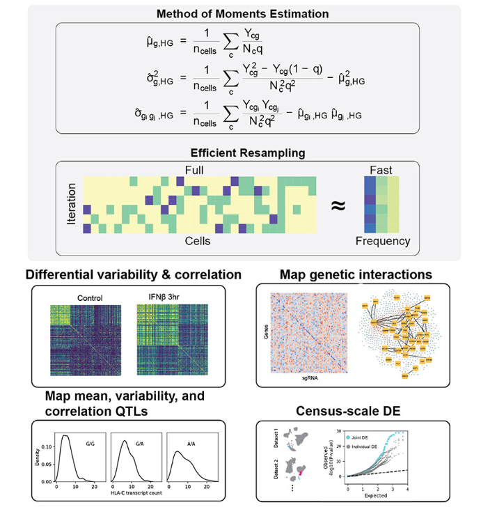
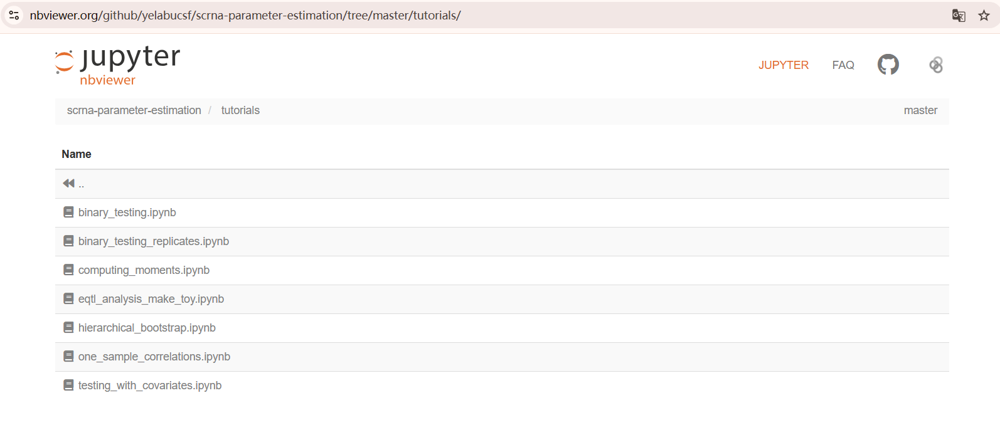
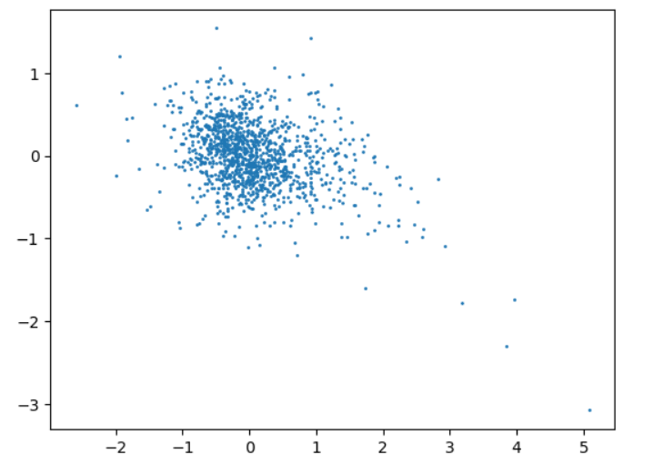
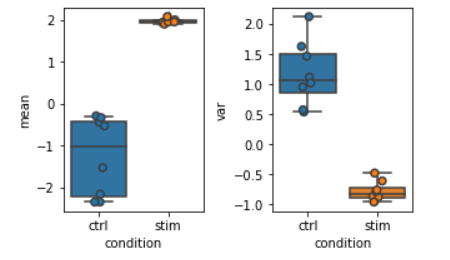
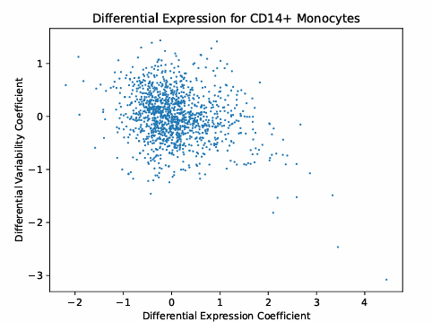
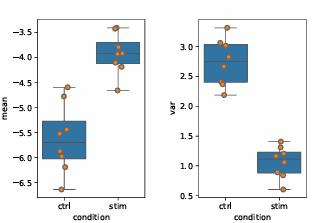
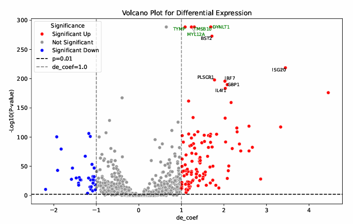
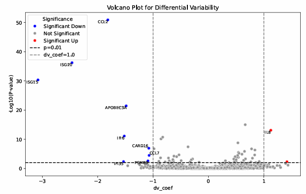

# 学习用memento做差异表达基因分析(DEA-memento)

---
写在前面：关注gene/marker开始于学习R的FindMarker(), FindAllMarker(), FindConserveMarker()，学到了pvalue等指标。后面用mulea和gpprofiler做富集分析，又遇到pvalue，还有eFDR，指标仍然还是指标，其意义不清楚。年初学习memento做差异基因表达分析，感觉这些差不多，都是围绕某些基因，或者说是把很多基因变成我们关注的少数的基因，分析其生物学意义。总的来看学的不easy，从生信实现过程中报错不少，生物学解读也不够透彻，知之甚少？故围绕那些不清楚问题进行总结性回答，期望能够规范学习，提高效率。另外，其余要学习的还不少（公共数据的挖掘，数据格式的认识和转换，差异表达基因分析新老方法的汇总，更加清晰和全面的可视化方案）

---
**新的问题1(2025/2/21)**: 到底什么是de_coef，什么是dv_coef，以及dv_se的意义，我们应该怎样科学的筛选出差异表达基因，现有的方法真的对吗?显然认为是有问题，可视化效果是不怎么好的。




- [学习用memento做差异表达基因分析(DEA-memento)](#学习用memento做差异表达基因分析dea-memento)
  - [一、what是什么](#一what是什么)
    - [（一）什么是差异表达基因分析？](#一什么是差异表达基因分析)
    - [（二）什么是memento？](#二什么是memento)
  - [二、memento的示例测试](#二memento的示例测试)
    - [（一）demo学习](#一demo学习)
    - [（二）结果解读](#二结果解读)
  - [三、deploy项目部署](#三deploy项目部署)
    - [（一） memento环境配置(memento--06)](#一-memento环境配置memento--06)
    - [（二） 项目部署测试](#二-项目部署测试)
    - [（三）结果可视化(二维图，箱线图，热图，火山图，小提琴图，PCA图)](#三结果可视化二维图箱线图热图火山图小提琴图pca图)
  - [四、干货总结](#四干货总结)
      - [（一）常见计算指标](#一常见计算指标)
  - [五、引用](#五引用)

## 一、what是什么
### （一）什么是差异表达基因分析？
**1. 定义**：差异表达基因分析（Differential Expression Analysis, DEA）是一种用于比较不同生物样本或不同处理条件下基因表达量变化的分析方法。通过识别基因在不同样本之间的表达差异，可以了解基因在不同生物状态下的功能和调控机制。

**2. 之前的分析方法**: 在高通量测序技术出现之前，基因表达分析主要依赖于基因芯片技术。对于基因芯片数据，由于其数据通常被认为服从正态分布，常用的分析方法是在每个基因上应用t检验或方差分析。然而，高通量分析涉及多个基因的同时检验，因此需要进行多重比较校正，以控制假阳性的发生。

**3. 常用的实现途径和软件包**
  - DESeq2：基于负二项分布模型，适用于RNA-seq数据的差异表达分析。它通过估计基因表达量的离散度来提高差异表达检测的准确性。
  - edgeR：同样基于负二项分布模型，适用于小样本量的RNA-seq数据。它通过贝叶斯方法估计离散度，从而提高统计检验的稳定性。
  - limma：最初用于基因芯片数据，但也可以用于RNA-seq数据。它通过线性模型和贝叶斯统计方法来检测差异表达基因。
  - FindMarkers(Seurat): FindMarkers()函数——可以对感兴趣的细胞亚群，去寻找它与其它所有的亚群，表达有差异的基因；或者给定两个亚群，单独比较这两个亚群之间的差异基因。
  - 参考资料:
    - [三种软件（DESeq2、edgeR、DEGseq）在转录组差异表达分析中的比较](https://mp.weixin.qq.com/s/z_0yfL4JdTEzlXrTf0__Fg)
    - [看完还不会来揍/找我 | 差异分析三巨头 —— DESeq2、edgeR 和 limma 包 | 附完整代码 + 注释（重制版）](https://mp.weixin.qq.com/s/pv49e-lf9ZnEAmSiQIflIQ)
    - [一文搞定三大 R 包的差异分析](https://mp.weixin.qq.com/s/W2ZAb7XwSPLD5MJQ-VFmoQ)
    - [RNA-seq入门实战（五）：差异分析——DESeq2 edgeR limma的使用与比较](https://mp.weixin.qq.com/s/G7LQHvybW32Kn-jPYR7k6A)
    - [细胞类群marker基因识别及可视化](https://mp.weixin.qq.com/s/XA0gP-uYJmgcSQ1VAAYxYA)

**4. 之前方法的不足**
  - 多重比较问题：早期方法（如t检验）在处理高通量数据时，由于涉及多个基因的同时检验，容易导致假阳性率过高。因此需要进行多重比较校正，如FDR校正。
  - 数据分布假设：基因芯片数据通常假设服从正态分布，但RNA-seq数据的分布特性与基因芯片不同，更适合用负二项分布来建模。
  - 样本量限制：在样本量较小时，传统的统计方法可能不够稳健，而现代的软件包（如DESeq2和edgeR）通过贝叶斯方法等改进了这一问题。
  - 数据预处理：早期方法对数据预处理的要求较高，而现代工具通常集成了更完善的预处理和归一化方法。

### （二）什么是memento？
**1. 是什么**: memento 是一种用于单细胞 RNA 测序（scRNA-seq）数据差异表达分析的工具，它通过矩估计（method of moments）框架来分析基因表达的均值、变异性和基因相关性。memento 采用多变量超几何采样过程，并利用 scRNA-seq 数据的稀疏性实现高效的自举策略，从而对细胞组之间的基因表达参数进行统计比较。

**2. 环境部署方法**
  ```bash
  pip install memento-de
  pip install --upgrade memento-de
  ```
**3. 相比之前老方法的优势**
  - 更显著和可靠的差异表达结果：memento 在多个实际应用中识别出更多显著且可重复的均值表达差异。
  - 考虑基因表达的变异性和相关性：除了分析基因表达的均值外，memento 还可以分析基因表达的变异性和基因之间的相关性，从而提供更全面的生物学见解。
  - 高效的自举策略：memento 采用高效的自举策略，能够快速计算校准良好的检验统计量，适合处理大规模数据集。
  - 可扩展性：memento 可以处理数百万个细胞和数千个样本，适用于大规模单细胞数据的分析。

**4. 官方文档和教程**: [memento](https://github.com/yelabucsf/scrna-parameter-estimation)


## 二、memento的示例测试
### （一）demo学习
[demo-tutorial](https://nbviewer.org/github/yelabucsf/scrna-parameter-estimation/tree/master/tutorials/)

*一共六个demo,主要学习这四个*
**1. binary_testing.ipynb**
  - 暂时认为经过SoupX处理过的counts无法进行memento测试
  - 考虑的是不同处理间的差异表达，处理的信息存储在stim键中，其中ctrl为0，stim为1(这里我有一疑问，如果是多种实验处理的话难道是0，1，2，3？)
  - [notebook](https://nbviewer.org/github/yelabucsf/scrna-parameter-estimation/blob/master/tutorials/binary_testing.ipynb)

**2. binary_testing_replicates.ipynb**
  - 分析的不同ind的**某些基因在ctrl和stim的差别**，以箱线图展示。某些基因在ctrl的其中一个样本中过度表达而在重复的其它样本并未高度表达，其结果不可靠，很大可能是假阳性。对于这种情况，该脚本分析了其在各个样本的表达情况，发现该基因在ctrl中表达趋势集中，说明数据可靠。可以做差异基因检测
  - [notebook](https://nbviewer.org/github/yelabucsf/scrna-parameter-estimation/blob/master/tutorials/binary_testing_replicates.ipynb)

**3. computing_moments.ipynb**
  - 考虑的仍然是不同处理间的差异表达，处理的信息存储在stim键中，其中ctrl为0，stim为1。不同的是在构建计算模型的时候添加了ind(individual即样本信息)，难道是考虑到样本间的批次效应。<u>我更认为ind是整合不同组研究同一问题的结果，即每一个ind应该都包含ctrl和stim，而不是简单的一个ctrl包含几个ind，一个stim包含另外几个ind</u>
  - 测试数据确实每个独立的ind包含一个ctrl和一个stim。如果简单以sample为ind会不会有问题？
  - [notebook](https://nbviewer.org/github/yelabucsf/scrna-parameter-estimation/blob/master/tutorials/computing_moments.ipynb)

**4. testing_with_covariates.ipynb**
  - covariates是**协变量**的意思，基因表达的多与少很大可能与染色质的异质性相关（结构强弱/ATAC），基因表达的counts数据与ATAC数据增强了数据的可靠性，有利于避免假阳性
  - [notebook](https://nbviewer.org/github/yelabucsf/scrna-parameter-estimation/blob/master/tutorials/testing_with_covariates.ipynb)

**5. 输入数据要求：**
  - **adata.X为counts数据，未经过标准化处理, 还要求为csr_matrix；**
  - **adata.obs必须包含ind, stim, cell这三个键；**
  - **ind指的是实验批次，stim指的是处理，cell指的是各个细胞分群名；**

### （二）结果解读
**1. 列表解读**
  `result_1d.query('de_coef > 0').sort_values('de_pval').head(10)`
| gene  | tx   | de_coef  | de_se    | de_pval  | dv_coef  | dv_se    | dv_pval           |
|-------|------|----------|----------|----------|----------|----------|-------------------|
|基因|处理|差异表达系数|差异表达标准误|差异表达P值|差异表达校正系数|差异表达校正标准误|差异表达校正P值|
| ISG15 | stim | 4.735176 | 0.080462 | 0.0      | -4.057520| 0.385885 | 3.703513e-26      |
| MX1   | stim | 3.718690 | 0.077490 | 0.0      | -1.348751| 0.147682 | 3.773009e-20      |
| GBP1  | stim | 2.169482 | 0.046397 | 0.0      | -0.840221| 0.127051 | 4.009790e-11      |
| TYMP  | stim | 1.041270 | 0.016814 | 0.0      | -0.161540| 0.077796 | 3.947181e-02      |
| H3F3B | stim | 0.654287 | 0.012470 | 0.0      | -0.268918| 0.071636 | 1.901070e-04      |
| IFI35 | stim | 2.472627 | 0.055519 | 0.0      | -1.229297| 0.170385 | 3.077914e-13      |
| IL4I1 | stim | 2.005472 | 0.046894 | 0.0      | -0.136503| 0.123821 | 2.466097e-01      |
| BST2  | stim | 1.737571 | 0.031173 | 0.0      | -1.054215| 0.142110 | 8.408791e-14      |
| PSMA4 | stim | 1.287618 | 0.031213 | 0.0      | 0.038375  | 0.175158 | 8.212502e-01      |
| ISG20 | stim | 3.729167 | 0.054182 | 0.0      | -2.799271| 0.135871 | 1.316147e-94      |

  - *基因名称（gene）*：表示被分析的基因，如LGALS1、FAM177A1等。这些基因在生物学研究中可能与特定的生物学过程或疾病相关。
  - *处理条件（tx）*：表示基因表达数据所对应的处理条件，在这里统一为stim，可能表示某种刺激或处理状态。
  - *差异表达系数（de_coef）*：表示基因在刺激条件下的表达变化程度，即基因表达量的变化倍数。<u>正值表示基因表达上调，负值表示基因表达下调。</u>例如，LGALS1的de_coef为0.019160，表示其表达变化较小；而CALM1的de_coef为1.329693，表示其表达显著上调。
  - *差异表达标准误（de_se）*：表示差异表达系数的标准误，用于衡量de_coef的精确度。标准误越小，表示差异表达系数的估计越准确。例如，LGALS1的de_se为0.017979，而CALM1的de_se为0.036177，说明CALM1的差异表达系数估计相对更不精确。
  - *差异表达P值（de_pval）*：表示基因差异表达的显著性水平，P值越小，表示基因表达差异越显著。例如，CALM1的de_pval为1.280737e-295，表示其差异表达非常显著，而PCNP的de_pval为0.07621075，表示其差异表达不显著。
  - *差异表达校正系数（dv_coef）*：表示基因在某种校正后的差异表达系数，可能与de_coef类似，但经过了某种校正或调整。例如，LGALS1的dv_coef为0.328217，表示其校正后的表达变化为0.328217。
  - *差异表达校正标准误（dv_se）*：表示校正后的差异表达系数的标准误，同样用于衡量dv_coef的精确度。例如，LGALS1的dv_se为0.063371，而CALM1的dv_se为0.116348。
  - *差异表达校正P值（dv_pval）*：表示校正后的差异表达P值，用于判断校正后基因表达差异的显著性。例如，CALM1的dv_pval为0.002585409，表示其校正后的差异表达仍显著，而PCNP的dv_pval为0.002314833，也表示其校正后的差异表达显著。
进一步认识de_coef和dv_coef的意义，进而选择合适的参数筛选出上调基因和下调基因
**2. 二维图解读**

*Thinking*：
  - 从上面的输出表格和输出图片可以很清楚的发现coef矫正前后的数值相差很大，那么选择上调基因和下调基因应该用那个参数呢；
  - 从图片可以发现部分基因矫正前很高，而矫正后为为负，那么进一步说明是因其中某一部分细胞异常高表达（很可能是因实验原因引起假阳性）导致统计水平上表现差异，但对于一类细胞分析应该保证整体大部分是有意义的异常。故可以通过两个指标共同大于0来筛选上调基因；
  - 另外思考就是，数据提供了se值，能否从这部分入手，个性化选择coef值作为筛选，如果要求两个coef都大于0来做筛选，发现heatmap并不明显；

**3. boxplot解读**

*boxplot_Thinking*：
  - 两个boxplot,一个是mean，一个是var，分别对应的是de_coef和dv_coef的值，每个boxplot都包含ctrl和stim，每个点代表每个ind；
  - 通过两种指标和分ind精确目标基因的方式，查看该基因是否为假阳性，作为差异基因是否可信，非常清晰的看到在不同ind的表达水平；

**4. 生物学意义**：
  - *基因表达调控*：通过分析de_coef和dv_coef，可以了解基因在特定刺激条件下的表达变化，从而推测基因在生物学过程中的调控作用。例如，CALM1和CALM3的高表达变化可能与细胞对刺激的响应密切相关。
  - *功能关联*：显著差异表达的基因可能参与特定的生物学通路或疾病过程。例如，CCR7的差异表达可能与细胞迁移或免疫反应相关。
  - *潜在治疗靶点*：显著差异表达且生物学功能明确的基因可能成为潜在的治疗靶点。例如，表达显著上调的CALM1可能在疾病发生中起关键作用，可作为治疗干预的靶点。


## 三、deploy项目部署
### （一） memento环境配置(memento--06)
|cloud-image|conda|env|L|conda-env|
|-|-|-|-|-|
|memento--06|-|-|python3.8|/usr/bin/python|

```bash
pip install memento-de
```

### （二） 项目部署测试
**1. 测试数据**：
  - `interferon_filtered.h5ad` 包含ind, stim, cell
  - `Pog_unsoupx.h5ad` 不包含ind, stim, cell，且adata.X标准化过

**2. 获取测试数据**:
  - [interferon_filtered.h5ad下载](https://github.com/ydgenomics/git_test/blob/main/interferon_filtered.h5ad)
  - [Pog_unsoupx.h5ad下载](https://github.com/ydgenomics/git_test/blob/main/Pog_unsoupx.h5ad)

**3. DEA-memento流程**：
  - 独立脚本: binary_testing_cg.py; binary_testing_replicates_cg.py; computing_moments_cg.py
  - 整合处理和可视化的最终部署脚本()：
    1. preprocess处理得到ind, stim, cell键，解决输入严格要求键的问题，检查替换adata.X为raw counts；
    2. 使用binary_testing_replicates.py的脚本计算1d test，可视化二维图和火山图(分别基于de和dv)；
    3. 根据1d筛选得到top_gene做computing_moments得到boxplot；
    4. 根据传参`perform_2d_test='yes'`来判断用top_gene做2d的differential coexpression testing
  - 脚本详细介绍:
> 主函数 `main` 是整个脚本的入口点，它通过命令行参数接收用户输入，并调用一系列函数来处理数据和生成结果。以下是 `main` 函数调用其它函数的流程：
> 1. **解析命令行参数**：
>   `main` 函数使用 `click` 库解析命令行参数，并将这些参数传递给脚本中的其它函数。
> 2. **读取输入数据**：
>   ```python
>   adata = sc.read(input_h5ad)
>   ```
>   使用 `scanpy` 库读取输入的 `.h5ad` 文件，存储在 `adata` 变量中。
> 3. **处理每种细胞类型**：
>   ```python
>   for cell_type in cell_type_list:
>      process_cell_type(adata, cell_type, ctrl_name, capture_rate, coef_threshold, pval_threshold, top_number, perform_2d_test)
>   ```
>   对于每种细胞类型，调用 `process_cell_type` 函数进行处理。
> 4. **处理单个细胞类型**：
>   `process_cell_type` 函数执行以下步骤：
>   - **创建目录**：
>     ```python
>     cell_type_dir = create_directories(cell_type)
>     ```
>     调用 `create_directories` 函数为当前细胞类型创建必要的目录。 
>   - **过滤数据**：
>     ```python
>     cell_adata = filter_data(adata, cell_type, ctrl_name, capture_rate)
>     ```
>     调用 `filter_data` 函数过滤并预处理数据。
>   - **执行一维假设检验**：
>     ```python
>     result_1d = perform_1d_hypothesis_testing(cell_adata)
>     ```
>     调用 `perform_1d_hypothesis_testing` 函数进行一维假设检验。
>   - **绘制结果**：
>     ```python
>     plot_results(result_1d, cell_type, coef_threshold, pval_threshold)
>     ```
>     调用 `plot_results` 函数绘制结果图。
>   - **保存结果**：
>     ```python
>     save_results(result_1d, cell_type)
>     ```
>     调用 `save_results` 函数保存结果。
>   - **获取和绘制顶级基因**：
>     ```python
>     top_genes = get_top_genes(result_1d, top_number)
>     plot_top_genes(cell_adata, top_genes, cell_type_dir, perform_2d_test)
>     ```
>     调用 `get_top_genes` 函数获取顶级基因，并调用 `plot_top_genes` 函数绘制这些基因的图。


**4. DEA-memento流程输入**
  - 流程参数说明：

| Column Name | Description |
|------------|-------------|
| EntityID | Task identifier |
| input_h5ad | Input h5ad file path |  
| pre_ind | Key storing sample batch info |
| pre_stim | Key storing treatment info |
| pre_cell | Key storing cell clustering info |
| ctrl_name | Control group value in stim/pre_stim column |
| cell_type_list | Cell clusters to analyze |
| perform_2d_test | Whether to perform 2D differential coexpression test |
| cpu | CPU resource allocation |
| mem | Memory resource allocation |

  - 表格投递任务：

| EntityID   | input_h5ad                                      | pre_ind   | pre_stim   | pre_cell       | ctrl_name               | cell_type_list | perform_2d_test | cpu | mem |
|-|-|-|-|-|-|-|-|-|-|
| memento-test | /Files/Chara/yangdong/memento/Pog_unsoupx.h5ad | sample    | sample     | leiden_res_0.50| V2.5R2404290045         | 0,1            | yes             | 2   | 8  |
| demo-test  | /Files/Chara/yangdong/memento/interferon_filtered.h5ad | ind       | stim       | cell           | ctrl                    | CD14+ Monocytes,CD4 T cells| yes             | 2   | 16  |

  - 输入注意：cell_type_list可以输入目标细胞群和目标基因列表，通过`,`连接以字符串输入，内置函数识别会后`split`得到细胞群名列表，例如`memento-test`

**5. DEA-memento流程输出**：
```
memento
├── CD14+ Monocytes
│   ├── differential_expression_replicate_CD14+ Monocytes.pdf
│   ├── result_1d_replicate_CD14+ Monocytes.txt
│   ├── topgenes_2d_test
│   │   ├── result_2d_replicate_CD14+ Monocytes_CCL2.txt
│   │   └── result_2d_replicate_CD14+ Monocytes_ISG20.txt
│   ├── topgenes_boxplot
│   │   ├── output_CCL2_boxplot.pdf
│   │   └── output_ISG20_boxplot.pdf
│   ├── volcano_DE_CD14+ Monocytes.pdf
│   └── volcano_DV_CD14+ Monocytes.pdf
└── CD4 T cells
    ├── differential_expression_replicate_CD4 T cells.pdf
    ├── result_1d_replicate_CD4 T cells.txt
    ├── topgenes_2d_test
    │   ├── result_2d_replicate_CD4 T cells_RPS2.txt
    │   └── result_2d_replicate_CD4 T cells_SOD2.txt
    ├── topgenes_boxplot
    │   ├── output_RPS2_boxplot.pdf
    │   └── output_SOD2_boxplot.pdf
    ├── volcano_DE_CD4 T cells.pdf
    └── volcano_DV_CD4 T cells.pdf
```

  - 输出结果在一个文件夹`memento`里面
  - 输出1d test的txt文件`result_1d_CD14+ Monocytes.txt`和1d test的二维图pdf文件`differential_expression_replicate_CD14+ Monocytes.pdf`，
  - 输出基于1d test表格的火山图`volcano_DE_CD14+ Monocytes.pdf`和`volcano_DV_CD14+ Monocytes.pdf`
  - 输出基于1d test表格筛选得到的top_gene的boxplot箱线图pdf文件于子文件夹`topgenes_boxplot`
  - 输出基于1d test表格筛选得到的top_gene做的2d test文件于子文件夹`topgenes_2d_test`
  - txt文件可用于后面的个性化的基因筛选和可视化

### （三）结果可视化(二维图，箱线图，热图，火山图，小提琴图，PCA图)

**1. 二维图**：


**2. 箱线图**：


**3. 热图**：heatmap是一种常用的可视化工具，用于展示数据矩阵中的数值分布情况。在单细胞RNA-seq数据分析中，热图通常用于展示基因表达水平在不同样本或细胞类型中的变化。以下是对热图结果的详细解释，包括如何解读热图中的颜色、行和列的含义，以及如何从热图中提取生物学信息。
  - 热图的基本结构
    - 行（Rows）：通常代表基因（genes），每一行对应一个基因的表达水平。
    - 列（Columns）：通常代表样本（samples）或细胞类型（cell types），每一列对应一个样本或细胞类型的基因表达水平。
    - 颜色（Colors）：表示基因表达水平的高低，通常使用渐变色（如蓝色表示低表达，红色表示高表达）。
  - 热图中的关键元素
    - 颜色条（Color Bar）：显示颜色与数值的对应关系，范围通常表示标准化后的基因表达水平。
    - 聚类树（Dendrogram）：显示行和列的聚类结果，表示基因或样本之间的相似性。
    - 分组标签（Group Labels）：显示每个样本所属的分组标签，帮助识别不同组之间的差异。
  - 如何解读热图结果
    - 颜色的含义：颜色深浅——颜色越深，基因表达水平越高。颜色范围——颜色条的范围越宽，基因表达水平的差异越大。
    - 行（基因）的含义：行的聚类——相似的基因会被聚在一起，表达水平高的基因在某些样本中颜色较深。行的排序——通常按聚类结果排序，也可根据其他标准排序。
    - 列（样本或细胞类型）的含义：列的聚类——相似的样本或细胞类型会被聚在一起，表达水平高的样本在某些基因中颜色较深。列的分组——通过比较不同组之间的颜色差异，可以识别出哪些基因在不同组之间存在显著差异。
  - 热图中的生物学信息
    - 差异表达基因：通过比较不同组之间的颜色差异，可以识别出哪些基因在不同组之间存在显著差异。
    - 基因表达模式：热图可以帮助识别基因表达的模式，某些基因可能在某些样本或细胞类型中高表达，而在其他样本或细胞类型中低表达。
    - 样本或细胞类型的相似性：通过比较列的聚类树，可以识别出哪些样本或细胞类型之间的相似性较高。
  - 进一步分析
    - 差异基因的生物学功能：通过基因本体（GO）分析或通路分析（如KEGG通路分析），可以进一步了解差异基因的生物学功能和参与的通路。
    - 样本或细胞类型的特征：通过比较不同样本或细胞类型的基因表达模式，可以识别出它们的生物学特征和潜在的功能差异。
  - 参考资料：
  > [Python图文复现2022|05-绘制单细胞差异分析热图](https://mp.weixin.qq.com/s/vP540N61s02H0vlcm5uRHQ)

**4. 火山图**：



**5. 小提琴图**：

**6. PCA图**：


## 四、干货总结
#### （一）常见计算指标
<style>
  table {
    font-size: 10px;
  }
</style>

| 指标       | 意义                               | 计算方式                     | 范围   | 优点                     | 缺点                     | 应用                                      |
|------------|------------------------------------|------------------------------|--------|--------------------------|--------------------------|-------------------------------------------|
| P 值       | 表示观察到的统计结果在零假设下的概率 | 统计检验（如 t 检验）         | 0 到 1  | 直观，易于理解           | 容易导致假阳性           | 选择 P 值小于 0.05 或 0.01 的基因          |
| 校正后的 P 值 | 调整后的 P 值，考虑多重假设检验     | Bonferroni 校正或 Benjamini-Hochberg 校正 | 0 到 1  | 减少假阳性               | 可能过于保守             | 选择校正后的 P 值小于 0.05 或 0.01 的基因  |
| FDR        | 控制假阳性比例                     | Benjamini-Hochberg 校正      | 0 到 1  | 比 Bonferroni 校正更灵活 | 在极端情况下仍可能过于保守 | 选择 FDR 小于 0.05 或 0.01 的基因          |
| eFDR       | 改进的 FDR，进一步提高假阳性控制精度 | 贝叶斯方法或其他高级统计模型  | 0 到 1  | 比传统 FDR 更精确         | 计算复杂                 | 在高通量数据分析中提供更可靠的显著性评估  |
| DE         | 评估基因在不同条件下的表达水平差异   | 统计检验（如 t 检验）         | 效应大小：因数据而异；P 值：0 到 1 | 直观，易于解释           | 容易导致假阳性           | 选择 `de_coef > 0.5` 且 `de_pval < 0.05` 的基因 |
| DV         | 评估基因在不同条件下的变异性差异     | 统计检验（如 Levene 检验）    | 效应大小：因数据而异；P 值：0 到 1 | 可以识别变异性显著变化的基因 | 容易导致假阳性           | 选择 `dv_coef > 0.5` 且 `dv_pval < 0.05` 的基因 |

## 五、引用
1. [Kim MC, Gate R, Lee DS, et al. Method of moments framework for differential expression analysis of single-cell RNA sequencing data. Cell. 2024;187(22):6393-6410.e16. doi:10.1016/j.cell.2024.09.044](https://www.cell.com/cell/fulltext/S0092-8674%2824%2901144-9)
2. [P值竟窜天高，我的流程错了吗](https://mp.weixin.qq.com/s/0vy40JvpOZkMhaUiq2Pdng)
3. [谈谈那些R处理结果中非常小的p值](https://mp.weixin.qq.com/s/Tc-7VynH8tUoBR9bX6ztPA)
4. [顶刊分享---单细胞RNA测序数据差异表达分析的moments framework方法](https://zhuanlan.zhihu.com/p/3568458676)
   > 作者还给了一些自己的示例代码，增加了一些可视化方案
5. 
