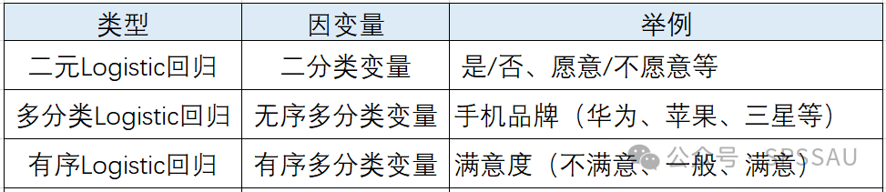
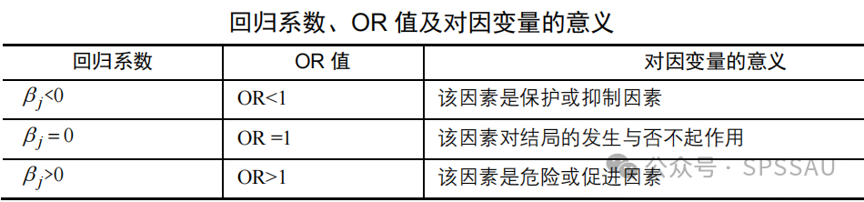

[Cell || Resource || 2024 || Memento: 用于单细胞 RNA 测序数据差异表达分析的矩量框架方法](https://mp.weixin.qq.com/s/WGl51Y8DiIQHybq4cM_bRA)
[差异基因找的不好？Cell刚发的这个单细胞差异统计的方法，可以用到咱们自己的数据上](https://mp.weixin.qq.com/s/5kwfiapfBKVSQmo5Zuh6EA)

### Gene1 cDNA Counts 和 Gene1 UMI Counts 的区别和联系

#### 1. **定义**
- **cDNA Counts**：
  - cDNA Counts 是通过将 RNA 转录为 cDNA 后进行扩增和测序得到的计数。这种方法在单细胞 RNA 测序（scRNA-seq）中较为常见，但由于 cDNA 扩增过程中的偏差，可能会引入技术噪声。
  - cDNA Counts 的测量结果通常需要通过复杂的统计模型（如零膨胀负二项分布模型，ZINB）来处理，因为它们包含大量的零值（dropout events）。

- **UMI Counts**：
  - UMI（Unique Molecular Identifiers）Counts 是在 cDNA 扩增之前，通过为每个转录本分配唯一的分子标签来计数的方法。这种方法可以有效减少扩增偏差，提供更准确的转录本数量。
  - UMI Counts 的分布通常更接近泊松分布或负二项分布（NB），并且不需要复杂的零膨胀模型。

UMI的标记保证了不会因扩增导致数据的异常，然而UMI一定就对吗？显然不是，例如gene1真实表达了5个转录本，而在UMI标记这一步仅仅只标记了4个，最后的cDNA counts是8个，那么可能我们就使用了4个这个数据，但这并不是真实的数据情况。另外对于UMI标记数据为0的情况，而最终cDNA数据却显示为10，说明在UMI标记这一部存在不好的配对情况，那么我们应该如何处理呢，仍然坚持0值，但这并非真实情况，这个时候似乎需要在UMI counts和 cDNA counts中做出一个平衡，既要避免过多的非正常的空值，又不能带入过多的人为操作引起整体数据的异常。

#### 2. **区别**
- **技术噪声**：
  - cDNA Counts 由于扩增过程中的偏差，技术噪声较大，尤其在低表达基因中表现明显。
  - UMI Counts 通过在扩增前标记每个转录本，减少了扩增偏差，技术噪声较低。

- **零值（Dropout Events）**：
  - cDNA Counts 中的零值（即某些基因在某些细胞中未检测到表达）较为常见，可能需要使用零膨胀模型（如 ZINB）来处理。
  - UMI Counts 中的零值相对较少，且分布更接近单峰分布，通常可以用简单的泊松或负二项分布模型来描述。

- **数据分布**：
  - cDNA Counts 的数据分布通常更复杂，可能需要更复杂的统计模型来拟合。
  - UMI Counts 的数据分布相对简单，更适合用简单的统计模型（如泊松或负二项分布）来分析。

#### 3. **UMI Counts 和 cDNA Counts 的数量关系**
- **数量差异**：
  - UMI Counts 通常低于 cDNA Counts，因为 UMI 通过去重操作减少了由于 PCR 扩增产生的重复计数。
  - cDNA Counts 包括了所有扩增后的分子，因此数量上会更多。

- **数据处理**：
  - 在单细胞测序数据分析中，UMI Counts 更常用于后续分析，因为它们能够更准确地反映基因表达水平。
  - cDNA Counts 可能需要额外的校正步骤来消除 PCR 扩增偏差。

#### 4. **实际应用中的选择**
- **UMI Counts**：
  - 适用于需要高精度基因表达分析的场景，尤其是在研究细胞异质性和基因表达动态变化时。
  - 在单细胞测序中，UMI Counts 是标准化后的数据，更适合用于细胞聚类、差异表达分析等。

- **cDNA Counts**：
  - 如果实验设计中没有使用 UMI 标识符，或者在某些特定的分析中需要考虑扩增后的分子数量，cDNA Counts 也可以被使用。

#### 总结
在单细胞测序中，UMI Counts 和 cDNA Counts 的数量是不同的。UMI Counts 通过消除 PCR 扩增偏差，提供了更准确的基因表达水平，而 cDNA Counts 包括了所有扩增后的分子，数量上更多。在实际分析中，通常优先使用 UMI Counts 来进行后续的数据分析。

---

### 为什么仍然存在 cDNA Counts 的概念？

尽管 UMI Counts 在单细胞 RNA 测序（scRNA-seq）中表现优异，但 cDNA Counts 仍然被广泛使用，主要原因如下：

#### 1. **历史和技术背景**
- **早期技术限制**：在 UMI 技术出现之前，cDNA Counts 是单细胞 RNA 测序的主要数据类型。许多早期的研究和分析方法都是基于 cDNA Counts 开发的。
- **技术成熟度**：cDNA Counts 的生成和分析流程相对成熟，许多研究者和实验室已经积累了大量的 cDNA 数据和分析经验。

#### 2. **实验设计和成本**
- **实验灵活性**：cDNA Counts 的生成过程相对简单，适用于多种实验设计，包括一些不需要高精度计数的场景。
- **成本考虑**：在某些情况下，使用 cDNA Counts 可能更经济，尤其是在样本量较大或资源有限的情况下。

#### 3. **数据分析需求**
- **复杂数据处理**：尽管 UMI Counts 在减少技术噪声方面表现优异，但 cDNA Counts 仍然在某些分析中具有独特的优势。例如，cDNA 数据可以提供更详细的转录本信息，尤其是在分析基因表达的动态变化时。
- **兼容性**：许多现有的分析工具和方法是为 cDNA 数据设计的，直接使用 cDNA Counts 可以避免额外的数据转换和处理步骤。

#### 4. **生物学背景和研究目标**
- **生物学噪声**：在某些研究中，生物学噪声（如细胞间异质性）可能比技术噪声更重要。cDNA Counts 可以提供更丰富的生物学信息，尤其是在分析细胞类型和状态的多样性时。
- **特定应用场景**：某些研究目标可能不需要高精度的 UMI 计数，例如在初步筛选或探索性分析中，cDNA Counts 已经足够。

#### 5. **UMI 技术的局限性**
- **UMI 的适用范围**：UMI 技术虽然减少了 PCR 扩增偏差，但在某些情况下（如低表达基因或高背景噪声）可能仍然不够完美。
- **数据处理复杂性**：UMI 数据的处理需要特定的工具和方法，而 cDNA 数据的处理相对简单，更适合一些没有复杂计算资源的研究团队。

### 总结
尽管 UMI Counts 在减少技术噪声和提高计数精度方面表现优异，但 cDNA Counts 仍然在单细胞 RNA 测序中被广泛使用。这主要是由于历史技术背景、实验设计灵活性、数据分析需求以及特定研究目标的综合影响。在某些情况下，cDNA Counts 提供的信息可能更适合研究者的分析目标。

单细胞 RNA 测序（scRNA-seq）仍然产生了稀疏数据，表现为即使在遗传相同的细胞暴露于相同环境中时，细胞间也存在高度变异（图1A）
挑战，样本异常而非真正的生物学变异

---
### 超几何抽样（Hypergeometric Sampling）

超几何抽样是一种概率抽样方法，它基于**超几何分布**，用于描述从有限总体中**不放回地抽取样本**时的随机事件概率。它是统计学和概率论中一个重要的概念，尤其在生物信息学、富集分析、抽样调查等领域有广泛应用。

### 1. **超几何分布的定义**
超几何分布描述了从有限总体中不放回地抽取样本时，某类特定对象出现的次数。具体来说，假设：

- **总体大小**：\( N \)（总体中对象的总数）。
- **成功对象数**：\( M \)（总体中属于某类特定对象的数量）。
- **样本大小**：\( n \)（从总体中抽取的样本数量）。
- **成功数**：\( k \)（样本中属于特定类别的对象数量）。

### 2. **超几何抽样的特点**
- **有限总体**：总体大小 \( N \) 是有限的，且已知。
- **不放回抽样**：每次抽取后，样本不会放回总体，因此每次抽取的概率会改变。
- **关注特定类别**：关注样本中某个特定类别的对象数量 \( k \)。
- **适用场景**：适用于总体大小有限且样本抽取对总体有显著影响的场景。

### 3. **超几何抽样的应用场景**
1. **生物信息学中的富集分析**：
   - 在基因富集分析（如 GO 富集分析、KEGG 富集分析）中，超几何分布用于评估某个基因集是否显著富集在特定的生物学通路或功能中。
   - 例如，给定一个基因集和一个通路中的基因数，通过超几何分布计算该基因集在通路中的富集概率。

2. **抽样调查**：
   - 在有限总体的抽样调查中，超几何分布用于估计样本中某个特定属性的频率。
   - 例如，从一批产品中抽取样本，评估次品的比例。

3. **质量控制**：
   - 在工业生产中，用于评估一批产品中次品的数量是否在可接受范围内。

### 4. **超几何抽样与二项抽样的区别**
- **超几何抽样**：
  - **不放回抽样**：每次抽取后，总体大小和特定类别的数量会减少。
  - **适用场景**：总体大小有限，样本抽取对总体有显著影响。

- **二项抽样**：
  - **有放回抽样**：每次抽取后，总体大小和特定类别的数量保持不变。
  - **适用场景**：总体大小较大，样本抽取对总体影响可以忽略不计。
  - **概率公式**：
### 6. **总结**
超几何抽样是一种基于超几何分布的概率抽样方法，适用于有限总体的不放回抽样场景。它在生物信息学、抽样调查和质量控制等领域有广泛应用。与二项抽样相比，超几何抽样更适用于总体大小有限且样本抽取对总体有显著影响的情况。

---
单细胞RNA测序（scRNA-seq）数据中寻找差异基因的数学原理主要基于统计学和机器学习方法，用于识别在不同细胞类型、状态或处理条件下的基因表达差异。以下是关键的数学原理和需要了解的概念：

### 1. **数学原理**
- **统计模型**：
  - **泊松分布和负二项分布**：用于建模基因表达的计数数据。这些分布可以描述基因表达水平的随机变化，帮助区分生物学变异和技术噪声。
  - **零膨胀模型（ZINB）**：用于处理基因表达数据中的大量零值（dropout events），这些零值可能源于技术或生物学原因。

- **假设检验**：
  - **t检验和Wilcoxon秩和检验**：用于比较两组细胞之间的基因表达差异。
  - **多重假设检验校正**：如Bonferroni校正或Benjamini-Hochberg校正，用于控制假发现率（FDR），避免因多重比较导致的假阳性。

- **贝叶斯方法**：
  - **贝叶斯统计**：通过贝叶斯框架估计基因表达差异的后验概率，这种方法可以整合先验知识，提高分析的稳健性。

- **机器学习方法**：
  - **随机森林和支持向量机（SVM）**：用于识别差异基因，这些方法可以处理高维数据并识别复杂的基因表达模式。
  - **深度学习**：如神经网络，用于自动提取基因表达数据中的特征，识别差异基因。

### 2. **需要了解的概念**
- **基因表达的分布特性**：
  - 理解基因表达数据的分布（如泊松分布、负二项分布）对于选择合适的统计模型至关重要。

- **细胞类型和状态的聚类**：
  - 使用聚类算法（如K-means、层次聚类）将细胞分组，以便在不同细胞类型或状态下寻找差异基因。

- **生物学重复和样本大小**：
  - 考虑生物学重复和样本大小对统计检验结果的影响，足够的重复和样本量可以提高分析的可靠性。

- **差异表达分析工具**：
  - 熟悉常用的差异表达分析工具，如DESeq2、EdgeR、Memento等。这些工具提供了不同的统计模型和算法来识别差异基因。

- **数据预处理和归一化**：
  - 数据预处理（如过滤低表达基因、归一化）对于减少技术变异和提高分析结果的可靠性非常重要。

### 3. **实际应用**
- **模拟数据和真实数据的分析**：
  - 使用模拟数据评估不同方法的性能，如Memento工具通过模拟具有不同均值、变异性和共表达的基因来评估差异表达分析的准确性。
  - 在真实数据中应用这些方法，如Memento在多个单细胞数据集中的应用，展示了其在识别差异表达基因、变异性和基因相关性方面的优势。

- **多组学数据的整合分析**：
  - 结合转录组学、蛋白质组学和表观遗传学数据，从多个层面寻找差异基因和调控机制。

### 总结
单细胞RNA测序数据中寻找差异基因的数学原理涉及统计建模、假设检验、贝叶斯方法和机器学习。理解基因表达的分布特性、细胞类型聚类、生物学重复、样本大小以及差异表达分析工具是进行有效分析的关键。通过模拟和真实数据的分析，可以评估不同方法的性能，并选择最适合特定数据集的分析策略。

---
单细胞数据特点，差异分析问题切入点，统计数据与生物学问题相关，假阳性问题
生物统计学，概率分布(连续性分布，离散性分布，抽样分布)，回归分析以及拟合(线性回归，多参数线性回归，非线性)，假设检验(卡方检验，t检验，ANOVA)，生存分析

## 一、单细胞数据的特点
Seurat(rds)和scanpy(h5ad)数据生态，即本质就是Matrix和table，数据具有极高的稀疏性。
单细胞数据分布的特点：1.高维度; 2.高噪声(由于实验技术和生物本身的变异性，可能表现为基因表达量的随机波动或大量零值(dropout events)); 3.异质性(细胞群体中存在多种细胞类型，具有不同的基因表达模式); 4.非正态分布(单细胞数据通常不符合正态分布, 通常是离散的); 5.泊松分布和负二项分布(单细胞数据的基因表达量通常可以用泊松分布或负二项分布来建模。泊松分布假设均值等于方差，但实际数据中往往存在过度离散（overdispersion），即方差大于均值。因此，负二项分布（允许方差大于均值）更适合描述单细胞数据); 6.对数正态分布。

---
## 二、单细胞数据的处理
归一化(normalizing)，找差异表达基因(high variable genes)，标准化(standardziation)，中心化(centering)
```R
# Seurat
pbmc <- NormalizeData(pbmc, normalization.method = "LogNormalize", scale.factor = 10000)
pbmc <- FindVariableFeatures(pbmc, selection.method = "vst", nfeatures = 2000)
pbmc <- ScaleData(pbmc, features = all.genes)
```
```python
# scanpy
sc.pp.normalize_total(adata, target_sum=1e4)
sc.pp.log1p(adata)
sc.pp.highly_variable_genes(adata, min_mean=0.0125, max_mean=3, min_disp=0.5)
sc.pp.scale(adata, max_value=10)
```

---
## 三、单细胞数据差异分析
### 问题1：都针对的是raw数据吗？标准化后的数据会减少其差异性，但如果是因为实验和技术原因产生的批次效应应该如何解决？Seurat方法三个函数的用法，针对的问题，尤其要搞清楚面向的layer是什么？counts就是原始数据，data就是经过归一化处理的数据
**Response**: 显然所有的函数都是对于归一化后的data进行处理的
  FindAllMarkers函数用于识别所有细胞群体之间的差异表达基因。它会自动对每个群体与其他群体进行两两比较，找出每个群体的特征性基因。
  FindMarkers 函数用于比较两个特定群体之间的差异表达基因。你需要明确指定要比较的两个群体，并找到它们之间差异显著的基因。
  FindConservedMarkers是对所有条件下鉴定保守标记,由于我们的数据集中有代表不同条件的样本，因此我们最好的选择是找到保守标记。此功能在内部按样本组/条件分离出细胞，然后针对所有其他聚类（或第二个聚类（如果指定））针对单个指定聚类执行差异基因表达测试。计算每种条件的基因水平p值，然后使用MetaDE R软件包中的荟萃分析方法跨组进行组合。
  查看输出时，我们建议寻找在**pct.1**和之间的表达差异**pct.2**较大且倍数变化较大的标记。例如，如果pct.1= 0.90和pct.2= 0.80，则可能不会像标记那样令人兴奋。但是，如果pct.2= 0.1，则较大的差异将更具说服力。同样，感兴趣的是表达标记的大多数细胞是否在我感兴趣的簇中。如果pct.1较低，例如0.3，则可能不会那么有趣。如上所述，这两个都是在运行功能时可能包括的参数。（condition_pct.1：在条件中的簇中检测到该基因的细胞百分比；condition_pct.2：在其他集群中平均检测到该基因的细胞所占的百分比）

### 问题2：存在批次的样本在整合的过程是不是应该先分别NormalizeData、FindVariableFeatures、scale.data之后再integratedata。如果一起做Normalizedata，很显然样本的批次会被放大。看了SCTransform和RLIGER方法，前者是分开的三步，后者是直接三步。那么自然不考虑其它问题，data自然是不一样的。
**Response**：分别预处理，然后再进行整合。优——可以减少批次效应在整合过程中的影响，尤其是在样本间存在显著差异时。劣——可能导致不同样本的变量基因选择不一致，影响后续整合效果。直接对所有样本一起进行NormalizeData、FindVariableFeatures和ScaleData，然后再进行整合。优——简化了流程，减少了因样本间预处理差异导致的不一致性。劣——如果样本间存在显著的批次效应，可能会放大这些差异，影响整合效果。所以先后顺序应该是与数据批次强弱相关的，而非绝对的一刀切！
```R
FindAllMarkers(
  object,
  assay = NULL,
  features = NULL,
  group.by = NULL,
  logfc.threshold = 0.1,
  test.use = "wilcox",
  slot = "data",
  min.pct = 0.01,
  min.diff.pct = -Inf,
  node = NULL,
  verbose = TRUE,
  only.pos = FALSE,
  max.cells.per.ident = Inf,
  random.seed = 1,
  latent.vars = NULL,
  min.cells.feature = 3,
  min.cells.group = 3,
  mean.fxn = NULL,
  fc.name = NULL,
  base = 2,
  return.thresh = 0.01,
  densify = FALSE,
  ...
)

FindMarkers(
  object,
  slot = "data",
  cells.1 = NULL,
  cells.2 = NULL,
  features = NULL,
  logfc.threshold = 0.1,
  test.use = "wilcox",
  min.pct = 0.01,
  min.diff.pct = -Inf,
  verbose = TRUE,
  only.pos = FALSE,
  max.cells.per.ident = Inf,
  random.seed = 1,
  latent.vars = NULL,
  min.cells.feature = 3,
  min.cells.group = 3,
  fc.results = NULL,
  densify = FALSE,
  ...
)

FindConservedMarkers(
  object,
  ident.1,
  ident.2 = NULL,
  grouping.var,
  assay = "RNA",
  slot = "data",
  min.cells.group = 3,
  meta.method = metap::minimump,
  verbose = TRUE,
  ...
)
```

### 问题3：之前看了很多关于DESeq2、limma、edgeR做差异基因分析，但是为什么不测试这几个软件呢，原来Seurat已经通过一个参数整合了这些软件的本质算法。我认为是Seurat方法使用于单细胞测序的数据，而老三样使用于microassay的数据，那GEO数据库上的数据类型，以及不同数据类型间的差异，导致了其方法学上使用上进一步的不同。
**Response**：芯片数据（Microarray Data）和测序数据（Sequencing Data）是基因组学和转录组学研究中常用的两种数据类型。
  - 芯片数据基于**探针杂交**原理。已知的基因序列对应的探针固定在芯片上，样品中的DNA或RNA与探针杂交，杂交强度与荧光信号的强弱成比例，用来反映基因的表达水平或基因变异。是一个相对封闭的系统，只能检测已知序列。
  - 测序数据直接读取核酸分子的碱基序列。以RNA-seq为例，将RNA逆转录成cDNA，并通过高通量测序仪读取碱基序列，生成数百万条短序列（Reads）。是一个相对开放的系统，可以检测已知和未知序列。
**`test.use`**
**Denotes which test to use. Available options are**:
  - "wilcox" : Identifies differentially expressed genes between two groups of cells using a Wilcoxon Rank Sum test (default); will use a fast implementation by Presto if installed
  - "wilcox_limma" : Identifies differentially expressed genes between two groups of cells using the limma implementation of the Wilcoxon Rank Sum test; set this option to reproduce results from Seurat v4
  - "bimod" : Likelihood-ratio test for single cell gene expression, (McDavid et al., Bioinformatics, 2013)
  - "roc" : Identifies 'markers' of gene expression using ROC analysis. For each gene, evaluates (using AUC) a classifier built on that gene alone, to classify between two groups of cells. An AUC value of 1 means that expression values for this gene alone can perfectly classify the two groupings (i.e. Each of the cells in cells.1 exhibit a higher level than each of the cells in cells.2). An AUC value of 0 also means there is perfect classification, but in the other direction. A value of 0.5 implies that the gene has no predictive power to classify the two groups. Returns a 'predictive power' (abs(AUC-0.5) * 2) ranked matrix of putative differentially expressed genes.
  - "t" : Identify differentially expressed genes between two groups of cells using the Student's t-test.
  - "negbinom" : Identifies differentially expressed genes between two groups of cells using a negative binomial generalized linear model. Use only for UMI-based datasets
  - "poisson" : Identifies differentially expressed genes between two groups of cells using a poisson generalized linear model. Use only for UMI-based datasets
  - "LR" : Uses a logistic regression framework to determine differentially expressed genes. Constructs a logistic regression model predicting group membership based on each feature individually and compares this to a null model with a likelihood ratio test.
  - "MAST" : Identifies differentially expressed genes between two groups of cells using a hurdle model tailored to scRNA-seq data. Utilizes the MAST package to run the DE testing.
  - "DESeq2" : Identifies differentially expressed genes between two groups of cells based on a model using DESeq2 which uses a negative binomial distribution (Love et al, Genome Biology, 2014).This test does not support pre-filtering of genes based on average difference (or percent detection rate) between cell groups. However, genes may be pre-filtered based on their minimum detection rate (min.pct) across both cell groups. To use this method, please install DESeq2, using the instructions at https://bioconductor.org/packages/release/bioc/html/DESeq2.html

### 问题4：在进行差异分析时，芯片数据和测序数据的处理方式存在显著差异，这主要源于它们的数据分布特点和统计假设。
#### 1. **芯片数据（Microarray Data）**
- **数据分布**：芯片数据通常假设为**正态分布**，因为其数据是连续的，且经过标准化处理后，可以近似符合正态分布。
- **差异分析方法**：
  - **常用工具**：`limma` 包是处理芯片数据的常用工具，它基于线性模型和贝叶斯统计方法，适用于正态分布的数据。
  - **分析流程**：
    1. 数据标准化（如RMA、MAS5.0）以减少技术变异。
    2. 构建设计矩阵（`design matrix`），用于描述样本分组信息。
    3. 使用`lmFit`和`eBayes`函数进行线性模型拟合和贝叶斯统计分析。
    4. 提取差异基因（`topTable`），并根据设定的阈值（如`logFC`和`p-value`）筛选显著差异基因。

#### 2. **测序数据（Sequencing Data，如RNA-seq）**
- **数据分布**：测序数据（如RNA-seq）通常假设为**负二项分布**，因为其数据是离散的（计数数据），且存在过度离散（overdispersion）现象，即方差大于均值。
- **差异分析方法**：
  - **常用工具**：`DESeq2`、`edgeR` 和 `limma`（结合`voom`）是处理测序数据的常用工具。
  - **分析流程**：
    1. 数据预处理：包括质量控制、比对、定量等步骤，生成基因表达矩阵。
    2. 数据标准化：如`DESeq2`中的`DESeqDataSetFromMatrix`和`DESeq`函数，`edgeR`中的`DGEList`和`calcNormFactors`。
    3. 构建设计矩阵，描述样本分组信息。
    4. 使用`DESeq2`的`results`函数、`edgeR`的`glmLRT`函数或`limma`的`lmFit`和`eBayes`函数进行差异分析。
    5. 提取差异基因，并根据设定的阈值（如`logFC`和`p-value`）筛选显著差异基因。

#### 3. **差异分析的差别**
- **芯片数据**：
  - 基于正态分布假设，适合使用`t检验`或`方差分析`（ANOVA）。
  - 数据经过标准化处理后，可以直接进行差异分析。
  - 对于小样本数据，`limma`包的贝叶斯方法可以提供更稳健的统计结果。
- **测序数据**：
  - 基于负二项分布假设，适合使用`DESeq2`、`edgeR`或`limma`（结合`voom`）。
  - 数据需要先进行标准化处理，以校正测序深度和样本间的技术变异。
  - 对于高通量测序数据，`DESeq2`和`edgeR`提供了更灵活的统计模型，可以处理过度离散。


[【综述】Nature Methods | 干货！一文读懂单细胞转录组分析的现状和问题！](https://mp.weixin.qq.com/s/pF95r2p0KK1LSW-l5YFrsw)
[单细胞转录组差异分析的8大痛点](https://mp.weixin.qq.com/s/4VThQEdclByz6jaJ3EQOdQ)
[单细胞下游分析 | 基础知识 | ③差异分析](https://mp.weixin.qq.com/s/2sQ2cbEQv2VWmKpXCTmTrQ)
伪bulk方法优于单细胞差异表达分析方法
[特异性基因筛选方法比较](https://mp.weixin.qq.com/s/8g4lSm8az7dyo__RZALL1w)

memento在差异表达分析的运用
[Cell | 用于单细胞RNA测序数据差异表达分析的矩框架方法](https://mp.weixin.qq.com/s/qza3_2a70xt9EG_8KRArqA)

---
## 四、数理统计方法
### t-test
科学研究中最常见的研究设计是将研究对象随机分为试验组和对照组，得到两组数据各自的研究结局，最后比较这两组结局总体的差异性。当两组结局为定性指标时，采用卡方检验，当两组结局为定量指标时，需要检测两组数据是否正态、方差是否齐性。如果两组数据都是正态且方差齐性，则采用t检验，否则采用非参数秩和检验（wilcoxon两样本秩和检验）（注：实际统计分析中，两组数据近似正态，如直方图呈现大致的中间多两边少，无严重极端值，也可选用t检验）。   
t检验的要求，是两组数据定量、正态、独立、方差齐。定量数据和正态性前面已经论述过。两组数据独立指的是两组数据的观察值相互独立，两组数据不存在相关性。方差齐性指的是两组数据的方差大致相同

单样本 T 检验：用于检验一个样本的均值是否与已知总体均值有显著差异。
双样本 T 检验：用于比较两个独立样本的均值是否显著不同，通常用于两组不同对象的对比。
配对样本 T 检验：用于比较同一个样本的两次测量数据的差异，例如在治疗前和治疗后的血压测量。
[统计学(一) | t检验](https://mp.weixin.qq.com/s/zBaKvaNR2ZziHlmcXVLrkQ)

```python
sc.tl.rank_genes_groups(adata, "leiden", method="t-test")
sc.pl.rank_genes_groups(adata, n_genes=25, sharey=False)
```
[两组正态数据的差异性分析：t检验](https://mp.weixin.qq.com/s/lqZ4oLIVJGWGezA3ZvzR9Q)

### Chi-square test (卡方检验)

### ANOVA检验

### Wilcoxon rank-sum (Mann-Whitney-U) test (曼-惠特尼U检验/Wilcoxon秩和检验)

The Mann–Whitney U test (also called the Mann–Whitney–Wilcoxon (MWW/MWU), Wilcoxon rank-sum test, or Wilcoxon–Mann–Whitney test) is a nonparametric statistical test of the null hypothesis that randomly selected values X and Y from two populations have the same distribution. Nonparametric tests used on two dependent samples are the sign test and the Wilcoxon signed-rank test.

是一种非参数统计检验方法，用于比较两个独立样本的中位数是否存在显著差异。这个检验方法适用于两组样本，其中样本不满足正态分布假设或方差齐性假设。它是对独立样本t检验的一种非参数替代方法。基本思想是将两组数据合并起来，然后按照数值的大小进行排序，接着计算每个样本中的秩次（rank），然后将这些秩次相加。最后，通过比较这两组秩次和来确定两组数据是否存在显著的差异。

问题：细胞群1的基因1的表达量和细胞群2的基因1的表达量是否存在显著的差异
原假设H0：细胞群1与细胞群2的基因1的表达量差异没有统计学意义
备择假设H1：细胞群1与细胞群2的基因1的表达量差异有统计学意义
注意：这里一直在讨论是否有统计学意义，并没有直接说有生物学意义，可能这就是因为存在假阳性问题

Mann-Whitney检验分析需要满足3个假设条件：
  条件1：因变量为连续变量或等级变量（已满足）
  条件2：自变量为二分类变量（已满足）
  条件3：具有相互独立的观测值（已满足）
  条件4：因变量不服从正态分布（需SPSS结果分析）
  条件5：因变量方差不齐（需SPSS结果分析）
  备注：条件4和条件5不是必须满足，但如果是正态分布，推荐使用独立样本t检验。

```python
sc.tl.rank_genes_groups(adata, "leiden", method="wilcoxon")
sc.pl.rank_genes_groups(adata, n_genes=25, sharey=False)
```

[关于Mann-Whitney U检验，看完这篇文章就全明白了](https://mp.weixin.qq.com/s/khMTIk-OMiaJp4-liy7GuQ)

### [logistic regression (逻辑回归)](0.trivial/2019(nature%20methods)_A%20discriminative%20learning%20approach%20to%20differential%20expression%20analysis%20for%20single-cell%20RNA-seq.pdf)
逻辑回归通常用于解决分类问题，比如：客户是否该买某个商品，借款人是否会违约等。实际上，“分类”是逻辑回归的目的和结果，中间过程依旧是“回归”，因为通过逻辑回归模型，我们得到的是0-1之间的连续数字，即概率，类似借款人违约的可能性。然后给这个可能性加上一个阈值，就变成了分类。

二元Logistic回归分析是一种用于研究因变量为二分类变量（如“是/否”、“成功/失败”）与一个或多个自变量之间关系的统计方法。
Logistic回归（又称逻辑回归）是一种广义的线性回归分析模型，用于研究分类型因变量与自变量之间影响关系。Logistic回归分析根据因变量的不同可分为二元Logistic回归、多分类Logistic回归，有序Logistic回归三类


1. 建立Logistic回归模型前需要进行单因素筛查、因变量0-1编码和分类自变量哑变量处理。自变量并不一定非要定类变量，它们也可以是定量变量。如果X是定类（学历、年龄等）数据，此时需要对X进行哑变量设置。（哑变量(Dummy Variable)，也称为虚拟变量或指示变量，是一种用于将分类变量（Categorical Variable）转换为数值形式的变量。哑变量通常取值为0或1，用于表示某个类别是否存在于某个观测中。哑变量的主要作用是将分类变量纳入回归分析或其他统计模型中。由于大多数统计模型（如线性回归）只能处理数值型变量，哑变量提供了一种将分类变量转换为数值形式的方法，从而可以进行数学建模。）
2. 建立 Logistic 回归模型的过程，较常见的是“先单后多”，即先通过单因素分析筛选自变量，然后仅保留有显著影响的自变量进行多因素回归。这种场景在探索性研究目的、自变量较多或样本量不足的情况下应用较多。单因素分析的常见方法有卡方检验、t 检验、方差分析和秩和检验。
3. 模型整体检验与评价：似然比卡方检验；Hosmer-Lemeshow检验；决定系数R方；模型预测准确率。【注意】：有些研究并不看中模型的预测能力，而主要关注的是因变量的相关影响因素。
4. 回归系数/OR值解读



```python
sc.tl.rank_genes_groups(adata, "leiden", method="logreg", max_iter=1000)
sc.pl.rank_genes_groups(adata, n_genes=25, sharey=False)
```
[深度解析 | 二元Logistic回归模型（单因素筛查、软件操作及结果解读）](https://mp.weixin.qq.com/s/L4pp03-kDObw9UkVfHQlAw)
[史上最全逻辑回归（原理+案例介绍）](https://mp.weixin.qq.com/s/tPPEY9Kkj-h5gXf_W0rYKA)

---
## 五、变量的类型
### 1. **分类变量（Categorical Variable）**
分类变量是用于表示数据所属类别的变量，其取值是有限的、离散的类别。这些类别之间没有数值上的大小关系，通常是名义上的区分。例如：
- **性别**：男、女
- **血型**：A型、B型、AB型、O型
- **职业**：医生、教师、工程师等

分类变量可以进一步分为：
- **名义分类变量**（Nominal Variable）：类别之间没有顺序关系，如性别、血型。
- **有序分类变量**（Ordinal Variable）：类别之间有顺序关系，如教育水平（小学、中学、大学）、满意度（非常满意、满意、不满意）。

### 2. **连续变量（Continuous Variable）**
连续变量是可以在一定范围内取任意值的变量，其取值是无限的、连续的。连续变量通常用于表示数值上的大小关系，可以进行加、减、乘、除等数学运算。例如：
- **身高**：1.75米、1.80米等
- **体重**：60公斤、70公斤等
- **温度**：25°C、30°C等

连续变量的特点：
- **无限性**：可以在一定范围内取任意值。
- **数值性**：可以进行数学运算，具有数值上的大小关系。

### 3. **数值变量（Numerical Variable）**
数值变量是用于表示数值的变量，可以进一步分为：
- **连续变量**：如身高、体重。
- **离散变量**（Discrete Variable）：取值是有限的、离散的数值，但这些数值之间有数值上的大小关系。例如：
  - **家庭成员数**：1人、2人、3人等
  - **某天的订单数**：0个、1个、2个等

离散变量与分类变量的区别在于，离散变量的取值有数值上的大小关系，而分类变量的取值是名义上的类别。

### 4. **总结**
- **分类变量**：表示数据所属的类别，取值是有限的、离散的，没有数值上的大小关系。
- **连续变量**：表示数值上的大小关系，取值是无限的、连续的。
- **离散变量**：表示数值上的大小关系，取值是有限的、离散的。

在数据分析中，了解变量的类型非常重要，因为它决定了可以使用的统计方法和分析技术。例如：
- **分类变量**：适合使用频率分析、卡方检验等。
- **连续变量**：适合使用均值、标准差、t检验、方差分析等。
- **离散变量**：适合使用频率分析、泊松分布等。


自变量（Independent Variable）是指在研究中被研究者主动操纵或控制的变量，用于观察其对因变量的影响。
因变量（Dependent Variable）是指在研究中被测量的变量，其值依赖于自变量的变化。
协变量（Covariate）是指在研究中既不是自变量也不是因变量，但可能影响因变量的变量。协变量通常用于控制其他可能的干扰因素，从而更准确地评估自变量对因变量的影响。
示例说明
假设你正在研究一种新的教学方法对学生成绩的影响：
- **自变量（X）**：教学方法（传统教学 vs. 新教学方法）。
- **因变量（Y）**：学生的考试成绩。
- **协变量（Covariate）**：学生的家庭背景、学习时间、初始成绩等。
通过控制协变量（如学生的初始成绩），可以更准确地评估新教学方法对学生成绩的独立影响，而不受其他因素的干扰。

---

差异分析问题切入点


为什么找两组数据的差异表达基因要求是raw数据，两组数学的可比性不应该做完归一化、标准化之后吗，还是说函数自带有标准化处理？


## 如何筛选top基因，也就是从找到的基因集里面缩小到更少的基因集合？
### 如何筛选基因
在使用memento工具进行差异表达分析时，筛选基因主要基于以下步骤：
1. **计算差异均值和差异变异性**：使用`memento.compute_1d_moments()`和`memento.compute_2d_moments()`函数来计算基因的均值和变异性。
2. **进行假设检验**：使用`memento.ht_2d_moments()`函数来进行假设检验，得到每个基因的p值。
3. **筛选显著基因**：根据p值和效应大小来筛选显著的差异表达基因和差异变异性基因。例如，可以选择p值小于0.05且效应大小较大的基因作为候选基因。
4. **多重检验校正**：对p值进行多重检验校正，如使用`memento.util._fdrcorrect()`函数来计算FDR校正后的p值，以控制假阳性率。

```R
ht_result = memento.get_2d_ht_result(result)
ht_result['corr_fdr'] = memento.util._fdrcorrect(ht_result['corr_pval'])
```

### Differential Variability Genes (DV) 的含义
差异变异性基因（Differential Variability Genes, DV）是指在不同条件下，基因表达的变异性存在显著差异的基因。具体来说，这些基因在某一条件下的表达变异性可能显著高于或低于其他条件下的变异性。这可能意味着这些基因在不同条件下的表达调控机制存在差异，或者受到不同因素的影响，导致其表达的稳定性不同。例如，在某种疾病状态下，某些基因的表达变异性可能增加，这可能与疾病的发生发展或异质性有关。

### DV 结果有正有负的原因
在计算差异变异性基因时，结果出现正负值主要是因为变异性效应大小（ve_coef）的计算方式。ve_coef 表示的是基因在不同条件下的变异性差异，正值表示在某一条件下基因的表达变异性增加，负值则表示变异性减少。例如，如果一个基因在处理组中的表达变异性比对照组高，则ve_coef为正值；反之则为负值。这种正负差异反映了基因在不同条件下的表达稳定性变化，有助于我们更全面地理解基因表达的调控机制。

### 是否越高越好
对于差异变异性基因的效应大小，不能简单地认为越高越好。效应大小的正负和大小需要结合具体的研究目的和生物学背景来解释。如果研究目的是寻找在某一条件下表达变异性增加的基因，那么较大的正值可能更有意义；而如果关注的是变异性减少的基因，则较大的负值可能更值得关注。关键是要根据研究问题和假设来判断哪些基因的变异性变化具有生物学意义。

之前的研究都关注于平均表达量，通过对分群后的A组细胞和B组细胞从基因平均表达来找到差异基因，另外的信息就是表达变化的倍数就是log2FC，这样就构成了传统的筛选方案，pvalue加上log2FC。
正如kimi所讲的那样，如果我们关注到一个基因在A组细胞和B组细胞里面，可能从平均表达来看两者是大差不差的，但是从分群表达的方差来看就是多样性Variability，可能A组比较稳定，细胞表达大差不差，而B组细胞的表达起伏很多，这种情况是可能出现的，那这种差异算不算差异基因呢？显然是的，从科学问题的角度，我们可能就会想到为什么会出现高方差和紊乱表达的情况，那么必然就是在其它基因/分子相互作用下引起的，而这种信息可能会因只关注基因的平均表达量而忽略点，从这个角度来看，做2d test也是有必要的，如果某一基因表现出极强的差异分布情况，很可能是上下调控的关系。
总结，pvalue是传统的指标，de_coef应该是平均表达的倍数？(具体是多少看一下原代码)，dv_coef指的是变异性即数据是否稳定与否，与平均表达量倍数没有关系
